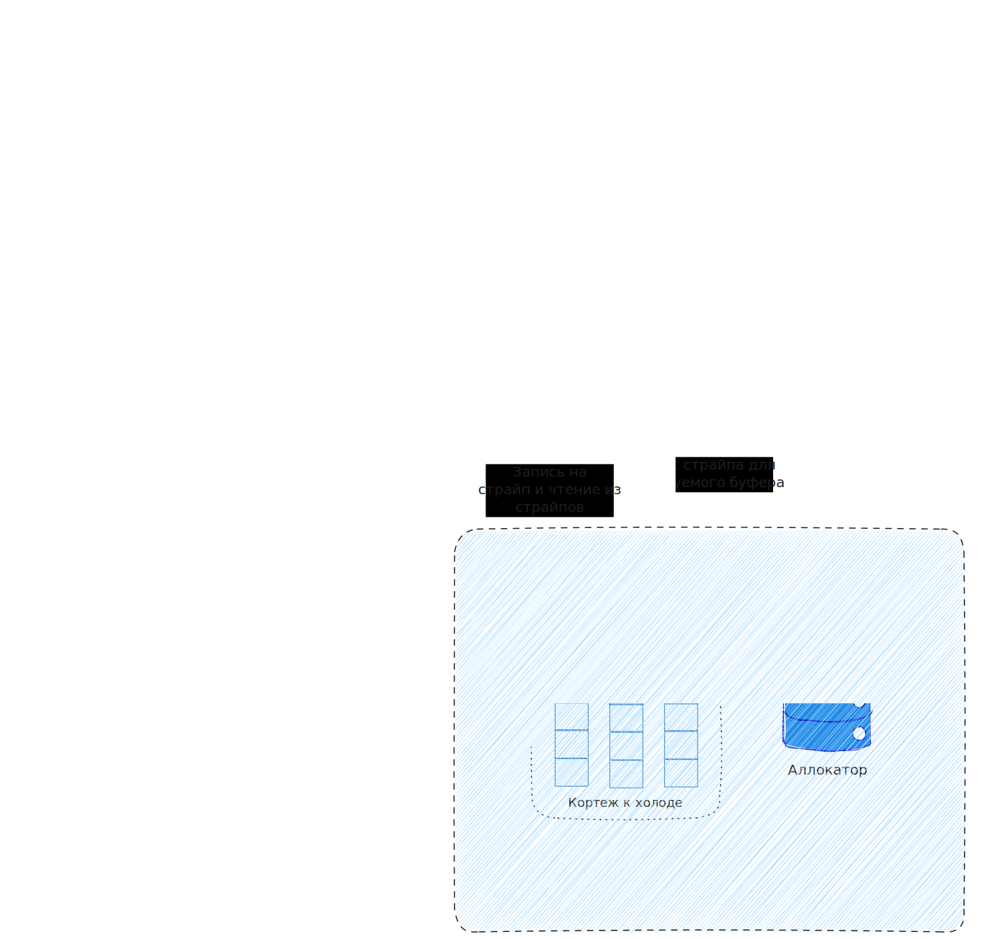
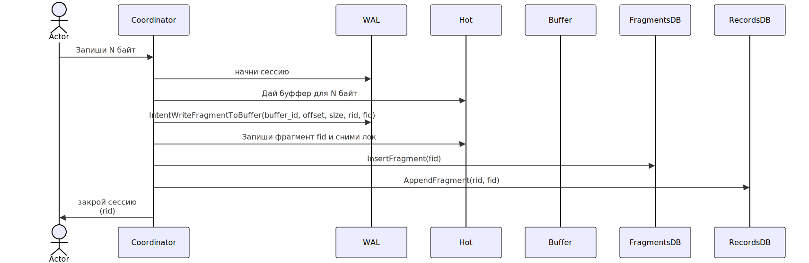
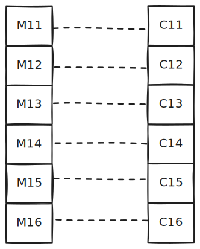
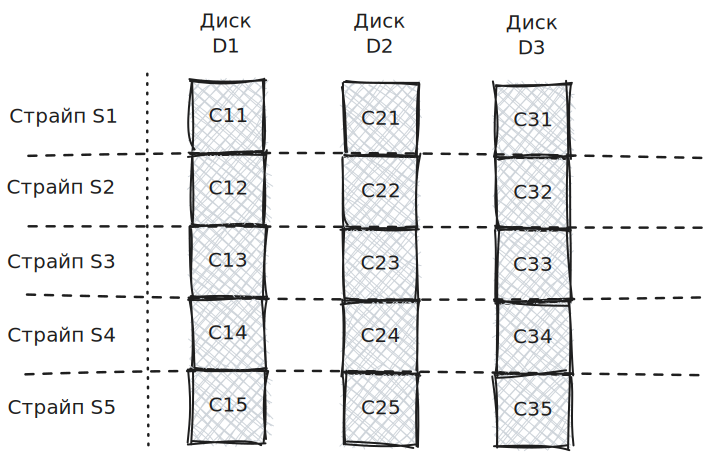
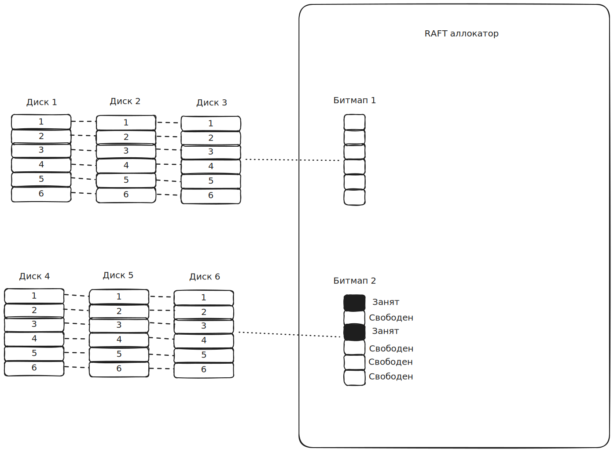

---
header-includes:
  - \usepackage{float}
  - \usepackage{placeins}
---

# Архитектура с каким-то крутым названием класса Colossus/Monolith и прочая.

- Бастион? Не, слишком ИБП.
- Парсек? Это дофига. Название выглядит фантастично. Вроде, сойдёт.
- Бегемот? Не, не то.
- Континент? Вроде тоже норм.
- Титан? Тоже норм.
- Мегалит? Вторично.
- Плато – от греческого "рюкзак" = σάκος πλάτης. Неплохо. Отражает суть хранилища, а "плато" - звучит. И подчёркивает, что архитектура крайне близка к оптимуму.
- Оптимус. Неплохо.

**Вывод: мне больше всего нравится Плато.**

## Глоссарий.

Система делится на следующие логические компоненты:

- Координаторы.
  - Без состояния.
- Холод.
  - RAFT-аллокатор. 64 операции при записи 2Гб в секунду. Ни о чём.
  - Наборы туплов дисков.
- Жара.
  - Узлы по 3 машины в идентичной аппаратной конфигурации. Есть варианты на HDD, есть на NVMe + NVDIMM (оптимально для видеохостингов со стримами).
- WAL (распределённый WAL).
  - Пока NATS + JetStream и KV, пойдёт и сам NATS, у него есть KV с хорошей структурой данных: индекс в памяти, данные в LSM. Прямо идеально под WAL-нагрузку.
- Метаданные.
  - Records: record.id -> record.metadata
  - Fragments: fragment.id -> (container.id, (crc64, size, compression_type, blake) - для дедупликации, что-то ещё)
  - RecordsFragmentsNo: record.id -> <сколько фрагментов в записи>
  - RecordsFragments: (seed(record.id) - для шардирования, record.id, номер фрагмента) -> fragment.id
  - Containers: container.id -> hot_ref | cold_ref
  - Tuples: tuple.id -> (disk1, …, diskN)

{fig-pos="H" width=0.95\linewidth}

## Процесс обычной загрузки данных.

1. Запись делится на фрагменты (ограничены длиной буфера в жаре). Длины фрагментов кроме последнего равны друг другу.
2. Фрагменты сохраняются в буфере. После чего лока сразу снимается.
3. Координатор ищет "свободный" буфер в жаре и берёт на него лок. После чего пишет в него и лок сразу снимается.
4. Добавляется запись в Records, добавляются записи о загруженных фрагментах в Fragments, добавляются связи между записью и её фрагментами в RecordsFragments.
5. Всё это производится под WAL-ом, по определённой схеме, так что при обрыве связи возможна докачка.

WritePath для заливки записи состоящей из одного фрагмента, похожим образом строится схема заливик многофрагментных записей.

{fig-pos="H" width=0.9\linewidth}

## Процесс чтения.

Возможные форматы чтения:

- Полное чтение.
- Чтение от сих до сих.

Обе схемы обслуживаются одним процессом:

1. Координатор ищет в Records данные по запрошенному record.id чтобы свериться, что запрос корректен.
2. Вычисляет индексы i…j фрагментов в записи которые нужно прочесть.
3. Читает данные из RecordsFragments начиная с (seed(record.id), record.id, i) до (seed(record.id), record.id, j) и получает оттуда []fragment.id.
4. Читает фрагменты из Fragments и находит ссылки на них (в холоде и жаре).
5. Читает фрагмент за фрагментом из указанных в данных фрагментов контейнеров.

# Физическое устройство системы.

В данном разделе мы покажем как устроены компоненты физически.

## Жара.

- Жара состоит из узлов.
- Каждый узел состоит из 3-х идентичных машин в разных ЦОД-ах.
- Каждая машина держит в себе набор NVMe и плашки энергонезависимой памяти (есть и дешёвые варианты с батарейкой и сбросом данных на флешки после обесточивания).
- Каждому диску $D_i$ соответствует область фиксированного размера на энергонезависимой памяти: $M_i$.
- Каждый диск $D_i$ делится на буферы фиксированного и одинакового размера (64Миб), $D_i = \left( C_{i1},\ldots, C_{iM} \right)$, а $M_i = \left( M_{i1}, \ldots, M_{iM}\right)$, тоже с одинаковым длинами $M_{ij}$.

Что хранится в $M_{ij}$: метаданные буфера (индекс контейнера, текущая позиция записи, текущий объём записанных данных – он может быть меньше позиции записи, если где-то были неудачи) + буффер по LBA: для того чтобы не фрагментировать данные дополняя их нулями и не перезаписывать LBA мы храним недозаполненные LBA в памяти и сбрасываем на NVMe после заполнения.

Запись осуществляется в один из буферов с достаточным свободным местом. При записи берётся лок на буфер, так что больше туда никто в этот момент писать не будет. Такой подход выбран для "плотного" наполнения LBA. Количество 64Мб буферов на одном 4Тб устройстве равно 64Кб штук, этого уже вполне достаточно, а всякие мультипуты делают такое ещё более безболезненным.

{fig-pos="H" width=0.9\linewidth}

### Альтернатива – всё то же самое без NVDIMM.

Придётся хранить базку (rocks, bolt и т.п.) с метаданными и смириться с фрагментацией – лучше дописать недозаполненный LBA нулями, чем делать его перезаписи, это убивает ресурс SSD. Ну и банально медленнее.

### Альтернатива - диск как кольцевой буфер.

В этом случае мы можем использовать и HDD. Схема такая:

- Диск делится на буферы по 64Мб.
- Мы начинаем писать в первый буфер. Если очередной фрагмент не помещается в остаток текущего буфера, мы запечатываем текущий и переходим к заполнению следующего.

## Холод.

Узел холода состоит из RAFT-аллокатора и кортежей дисков.

Кортеж $T = \left( D_1, \ldots, D_N \right)$

Каждый $D_i$, как и в случае жары, делится на блоки одинакового (между всеми дисками кортежа) размера:

$$
D_i = \left(C_{i1}, \ldots, C_{iK}\right)
$$

Страйпом $S_j$ в кортеже T мы назовём набор блоков одинакового индекса на дисках кортежа:

$$
S_j = \left(C_{1j}, \ldots, C_{Nj} \right)
$$

Т.е. диски и кортежы в страйпе выглядят вот так

{fig-pos="H" width=0.9\linewidth}

В аллокаторе кортежу соответствует битмап, а страйпу в кортеже – 1 бит. 1Эб дискового пространства будет соответствовать 2Гб битмап.

Таким образом, задача нахождения страйпа для переноса из горячего в холодное хранилище будет заключаться в:

1. Выбор кортежа дисков.
2. Выбор страйпа на диске (один из нулевых битов).

Все необходимые данные для 1Эб дискового пространства занимают меньше 16Гб.

При скорости миграции в 2Гб/с аллокатору нужно выполнять 64 RAFT-операции.

{fig-pos="H" width=0.9\linewidth}

# Операции в системе.

## Идентификаторы.

Идентификаторы выдаются координаторами. Используется следующая методика: для каждого типа идентификатора мы храним счётчик u128 на etcd: record_id, fragment_id, container_id и т.д. Координатор сразу захватывает диапазон. Скажем, 100 000 или миллион. И затем выдаёт значения из этого диапазона.

## Миграция из жары в холод.

Она начинается когда узел жары обращается к координатору с задачей перевоза.

В этом случае, координатор жары:

1. Вычитывает все <=64Мб буфера.
2. Запрашивает у аллокатора страйп.
3. Вычисляет контрольные блоки в дополнение к имеющимся блокам данных.
4. Раскидывает данные по блокам страйпа.
5. Подтвержает занятие страйпа.
6. Подменяет ссылку в Containers на ColdRef - текущий страйп.

Естественно, этот процесс чуть более хитрый, проходит под контролем WAL-а, приходится запускать пульс в аллокатор чтобы он не сбросил занятие страйпа, но по сути всё то же самое.

## Стриминг.

Первый вариант жаркого узла рассчитан на поддержку эффективной стримовой записи. В отличии от записи одного фрагмента, стримовая запись занимает буфер и периодически обновляет владение им, наполняя его данным до заполнения, после чего помечает буфер запечатанным и обновляет запись в Fragments.

Подробнее о записи в Fragments: там есть режим указывающий что фрагмент находится в заполнении. В этом случае метаданные такого фрагмента хранятся в горячем узле. Это нужно чтобы избежать частых обновлений записей этого фрагмента. При заполнении или при окончании стримв запечатка так же обновляет запись в Fragments на конечное состояние хранимое в дескрипторе буфера.

## Уплотнение данных на страйпах.

Уплотнение страйпов заключается в персборке N страйпов в M страйпов, где M < N. В метаданных контейнера должны хранится следующие данные: объём незанятого места (не удалось записать фрагмент во время наполнения или фрагмент был удалён – место фрагмента считается свободным) и средний размер фрагмента на диске.

Алгоритм компактизации выглядит следующим образом:

1. Берём один страйп являющийся кандидатом на уплотнение.
2. Переносим неудалённые фрагменты на заранее выбранный страйп.
3. Выбираем следующий страйп и наполняем текущий приёмник его фрагментами.
4. И так далее.

При заполнении приёмника данными из источника мы можем прийти к следующим состояниям:

- Источник вычитан, но в приёмнике ещё достаточно места. Тогда продолжаем процесс переходя к новому источнику.
- Приёмник забит, но источник ещё не вычитан. Тогда подтверждаем занятие приёмника и ищем следующий.
- Источников больше нет. Перенос данных останавливается.
- Приёмников больше нет. Но это уже общая проблема кластера, т.к. приёмники мы выбираем из всех туплов, а не только с данного. В этом случае помечаем приёмники свободными, миграция сбрасывается.
- Мы достигли ограничения на количество N источников. Останавливаем процесс.

В процесса перевоза данных мы ведём словарь fragment.id: old_ref -> new_ref.
При завершении перевоза мы начинаем проводить перезаписи размещений фрагментов на новые со старых.

По завершении перевоза мы помечаем все вычитанные источники свободными (обнуляем биты в битмапах кортежей).

## Удаление фрагментов.

Фрагменты готовятся к удалению когда на них больше не осталось ссылок в RecordsFragments. Процедура определения этого факта весьма тяжела если делать напрямую:

1. Хранение обратного индекса fragment.id -> (record.id, индекс фрагмента). Работать такое, скорее всего будет, но базке от такого точно будет нелегко. Потому что здесь O(1) от RecordsFragments, а это самая большая коллекция у нас.
2. Полное сканирование RecordsFragments. Это тяжело и ненадежно: никто не гарантирует доступность всех шардов во время скана базы.
3. Подсчёт ссылок и хранение времени доступа. Достаточно надёжно: refcount <= 0 и фрагмент не трогался уже длительное время – с большой вероятностью он больше ни на что не указывает. Но такой подход требует перезаписей метаданных фрагментов (можно делать раз в сутки: видим что чисталось менее 24 часов назад – не трогаем время последнего чтения).

Каждый вариант здесь обладает своими существеннейшими недостатками.

Но есть один рабочий вариант часто применяемый для "exascale":

- Запрещаем дедупать на слишком старые фрагменты. Скажем, не старее трём месяцев.
- Раз в какое-то время делаем снапшоты RecordsFragments и закидываем в clickhouse/spark/flink и прочая.
- Раз в какое-то время делаем outer join-ы по fragments_id и выбираем те, у которых нет связей. Если они старые то они более ни к чему не прикреплены и их можно удалять.
